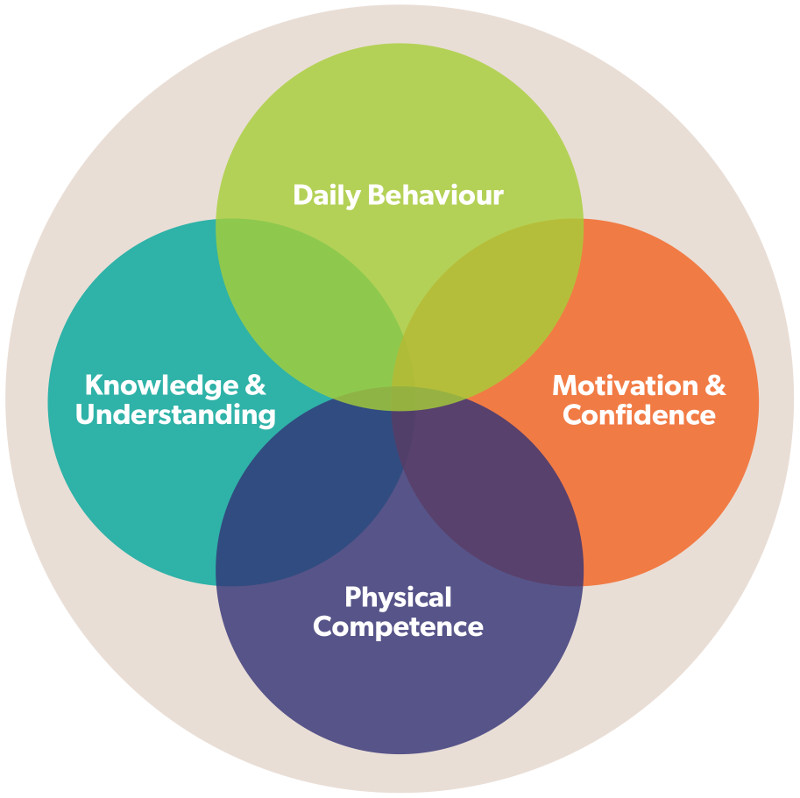
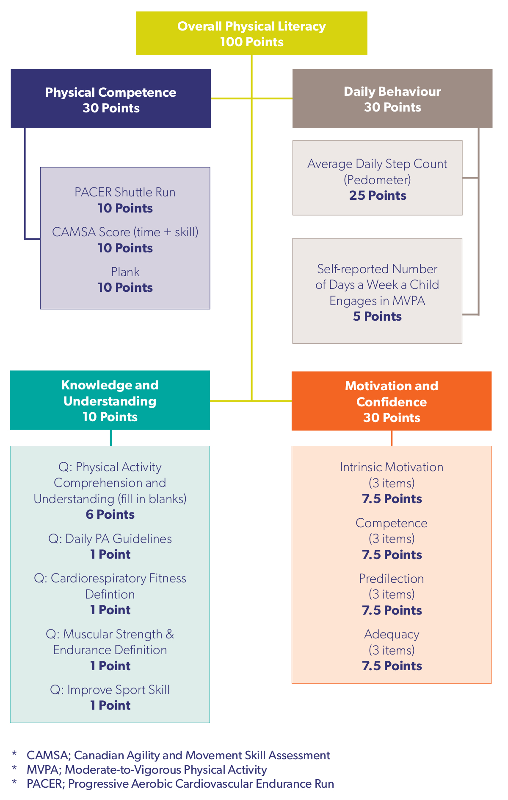
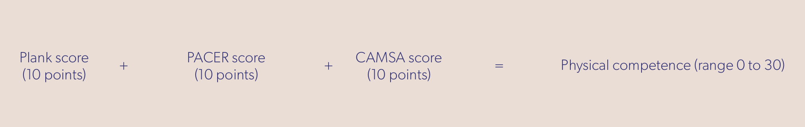
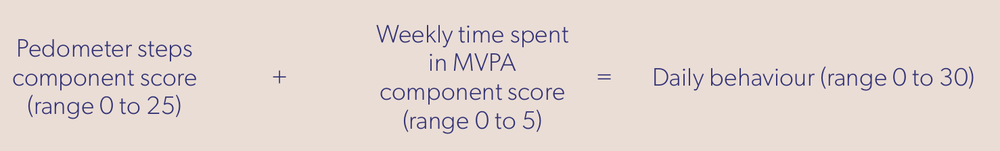
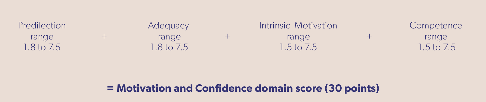
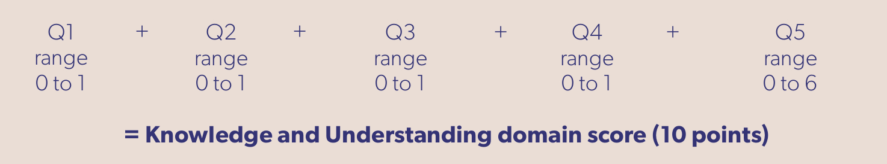
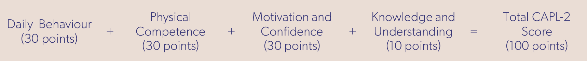

<style>
  img { border: 0;}
  p { margin-top: 1rem;line-height: 1.5rem; }
  a, a:visited { color: #00a79d; }
  a:hover { color: #333376; }
</style>


```{r setup, include = FALSE}
knitr::opts_chunk$set(
  collapse = TRUE,
  comment = "#>"
)
```

## Introduction

<a href="https://www.capl-eclp.ca" target="_blank">The Canadian Assessment of Physical Literacy (CAPL)</a> is the first comprehensive protocol that can accurately and reliably assess a broad spectrum of skills and abilities that contribute to and characterize the physical literacy level of a participating child.

Physical literacy moves beyond just fitness, motor skill or motivation in isolation. The CAPL is unique in that it can assess the multiple aspects of physical literacy: physical competence, daily behaviour, motivation and confidence, and knowledge and understanding.

The domains of physical literacy are summarized in figure 1 of <a href="https://www.capl-eclp.ca/wp-content/uploads/2017/10/capl-2-manual-en.pdf" target="_blank">the CAPL-2 manual</a> on page 6:



<a href="https://www.haloresearch.ca" target="_blank">The Healthy Active Living and Obesity Research Group (HALO)</a> has been responsible for the systematic development of the CAPL since 2008. HALO’s test development efforts have been informed by the assessment of more than 10,000 children and with input from well over 100 researchers and practitioners within related fields of study.

The `capl` package contains tools enabling users to compute and visualize CAPL-2 (Canadian Assessment of Physical Literacy, Second Edition) scores and interpretations from raw data, all within the R environment without having to use the <a href="https://www.capl-eclp.ca" target="_blank">CAPL-2 website</a>.

## Installation
### GitHub

Users can download and install the most recent version of the `capl` package directly from GitHub (<a href="https://github.com/barnzilla/capl" target="_blank">www.github.com/barnzilla/capl</a>) using the `devtools` R package. 

```{r warning = FALSE, message = FALSE, eval = FALSE}
devtools::install_github("barnzilla/capl", upgrade = "never", build_vignettes = TRUE, force = TRUE)
library(capl)
```

```{r warning = FALSE, message = FALSE, echo = FALSE}
library(capl)
```

Once the `capl` package is loaded, any available tutorials for the package, such as this vignette, can be accessed by calling the `browseVignettes()` function.

```{r warning = FALSE, message = FALSE, eval = FALSE}
browseVignettes("capl")
```

## Getting started
### Importing raw data

Users must first import their raw data before using the `capl` package to compute CAPL-2 scores and interpretations. The `import_capl_data()` function enables users to import data from an Excel workbook into the R global environment.

```{r warning = FALSE, error = FALSE, eval = FALSE}
data <- import_capl_data(
  file_path = "c:/path/to/raw-data.xlsx",
  sheet_name = "Sheet1"
)
```

<a name="required-variables"></a>

### Required variables

The `capl` package requires 60 variables in order to compute CAPL-2 scores and interpretations. Users can use the `get_missing_capl_variables()` function to retrieve a list of the required variables. The required variables are outlined in the Details section of the documentation.

```{r warning = FALSE, message = FALSE, eval = FALSE}
?get_missing_capl_variables
```

The `capl` package is looking for 60 variables by the following names:

* `age`
* `gender`
* `pacer_lap_distance`
* `pacer_laps`
* `plank_time`
* `camsa_skill_score1`
* `camsa_time1`
* `camsa_skill_score2`
* `camsa_time2`
* `steps1`
* `time_on1`
* `time_off1`
* `non_wear_time1`
* `steps2`
* `time_on2`
* `time_off2`
* `non_wear_time2`
* `steps3`
* `time_on3`
* `time_off3`
* `non_wear_time3`
* `steps4`
* `time_on4`
* `time_off4`
* `non_wear_time4`
* `steps5`
* `time_on5`
* `time_off5`
* `non_wear_time5`
* `steps6`
* `time_on6`
* `time_off6`
* `non_wear_time6`
* `steps7`
* `time_on7`
* `time_off7`
* `non_wear_time7`
* `self_report_pa`
* `csappa1`
* `csappa2`
* `csappa3`
* `csappa4`
* `csappa5`
* `csappa6`
* `why_active1`
* `why_active2`
* `why_active3`
* `feelings_about_pa1`
* `feelings_about_pa2`
* `feelings_about_pa3`
* `pa_guideline`
* `crf_means`
* `ms_means`
* `sports_skill`
* `pa_is`
* `pa_is_also`
* `improve`
* `increase`
* `when_cooling_down`
* `heart_rate`

### Loading the pre-installed dataset

The `capl` package comes with a demo (fake) dataset of raw data, `capl_demo_data`, which contains 500 rows of participant data on <a href="#required-variables">the 60 variables</a> that are required by the `capl` package. Users can load the demo dataset and start exploring. 

```{r warning = FALSE, message = FALSE}
data("capl_demo_data")
```

The base R `str()` function allows users to get a sense of how the CAPL-2 raw data should be structured and named for downstream use in the `capl` package. 

```{r warning = FALSE, message = FALSE}
str(capl_demo_data)
```

<a href="#required-variables">The 60 required variables</a> can also be quickly accessed by calling the base R `colnames()` function.

```{r warning = FALSE, message = FALSE}
colnames(capl_demo_data)
```

### Generating demo raw data

The `capl` package is also equipped with the `get_capl_demo_data()` function. This function allows users to randomly generate demo raw data and takes parameter `n` (set to 500 by default). This parameter is used to specify how many rows of demo raw data to generate and must, therefore, be an integer greater than zero. Users, for example, can randomly generate demo raw data for 10,000 participants by executing a single line of code: 

```{r warning = FALSE, message = FALSE}
capl_demo_data2 <- get_capl_demo_data(n = 10000)
```

The base R `str()` function can be called to verify how many rows and columns of data were created.

```{r warning = FALSE, message = FALSE}
str(capl_demo_data2)
```

### Exporting data to Excel

If users prefer to examine the CAPL demo raw data in a workbook, the `export_capl_data()` function allows them to export data objects to Excel.

```{r warning = FALSE, message = FALSE, eval = FALSE}
export_capl_data(capl_demo_data2, "c:/path/to/store/capl_demo_data2.xlsx")
```

### Renaming variables

If users have imported their own raw data and plan to use the main function, `get_capl()`, in the `capl` package to compute CAPL-2 scores and interpretations, they must ensure their variables names match the names of the 60 required variables. Users can rename their variables by calling the `rename_variable()` function. This function takes three parameters: `x`, `search`, and `replace`. The `x` parameter must be the raw data object, the `search` parameter must be a character vector representing the variable name(s) to be renamed, and the `replace` parameter must be a character vector representing the new names for the variables specificed in the `search` parameter. Below we show how to rename variables using a fake dataset called `raw_data`.  

```{r}
# Create fake data
raw_data <- data.frame(
  age_years = sample(8:12, 100, replace = TRUE),
  genders = sample(c("girl", "boy"), 100, replace = TRUE, prob = c(0.51, 0.49)),
  step_counts1 = sample(1000:30000, 100, replace = TRUE),
  step_counts2 = sample(1000:30000, 100, replace = TRUE),
  step_counts3 = sample(1000:30000, 100, replace = TRUE),
  step_counts4 = sample(1000:30000, 100, replace = TRUE),
  step_counts5 = sample(1000:30000, 100, replace = TRUE),
  step_counts6 = sample(1000:30000, 100, replace = TRUE),
  step_counts7 = sample(1000:30000, 100, replace = TRUE)
)

# Examine the structure of this data
str(raw_data)

# Rename the variables
raw_data <- rename_variable(
  x = raw_data,
  search = c(
    "age_years", 
    "genders", 
    "step_counts1", 
    "step_counts2", 
    "step_counts3", 
    "step_counts4", 
    "step_counts5", 
    "step_counts6", 
    "step_counts7"
  ),
  replace = c(
    "age", 
    "gender", 
    "steps1", 
    "steps2", 
    "steps3", 
    "steps4", 
    "steps5", 
    "steps6", 
    "steps7"
    )
)

# Examine the structure of this data
str(raw_data)
```

<a name="validation"></a>

### Eliminating noisy errors with validation

One of the coding philosophies behind the `capl` package is to create a "quiet" user experience by suppressing "noisy" error and warning messages via validation. That is, the `capl` package returns missing or invalid values as NA values instead of throwing “noisy” errors that halt code execution. If any variable is missing, for example, the `get_capl()` function will continue to execute without throwing error or warning messages. The `get_missing_capl_variables()` function will create required variables that are missing and populate these variables with NA values. In order to implement the validation philosophy, every `capl` function enlists helper functions to validate the data. If a given value is not of the correct class or out of range, an NA will be returned.

#### Validation functions in the `capl` package

There are eight functions included in the `capl` package (displayed in alphabetical order) to help provide a "quiet" user experience: 

* `validate_age()`
*	`validate_character()`
*	`validate_domain_score()`
*	`validate_gender()`
*	`validate_integer()`
*	`validate_number()`
*	`validate_scale()`
*	`validate_steps()`

Users can learn more about these functions by accessing the documentation within the R environment. 

```{r eval = FALSE}
?validate_age
?validate_character
?validate_domain_score
?validate_gender
?validate_integer
?validate_number
?validate_scale
?validate_steps
```

#### Validation of age

The CAPL-2 is currently validated with 8- to 12-year-old children. However, when a function requires the `age` variable to execute a computation (e.g., `get_capl_interpretation()`), the `age` variable is validated via the `validate_age()` function.

```{r}
validated_age <- validate_age(c(7, 8, 9, 10, 11, 12, 13, "", NA, "12", 8.5))
```

Notice the NA values in the results.

```{r}
validated_age
```

The first element is NA because the original value is 7. The next five elements are identical to their original values because they are integers between 8 and 12. The seventh element is NA because the original value is 13. The next two elements are NA because the original values ("" and NA) are obviously invalid. The last element is 8, but notice that the original value is a decimal. Because 8.5 is between 8 and 12, it is considered valid but the floor of the value is returned since CAPL performs age-specific computations based on integer age.

#### Validation of gender

The CAPL-2 is currently validated for children who identify as boys or girls. When a function requires the `gender` variable to execute a computation (e.g., `get_capl_interpretation()`), the `gender` variable is validated via the `validate_gender()` function.

```{r}
validated_gender <- validate_gender(c("Girl", "GIRL", "g", "G", "Female", "f", "F", "", NA, 1))

validated_gender
```

Notice the results again. This function accepts a number of case-insensitive options (e.g., "Girl", "G", "Female", "F", 1) for the female gender and returns a standardized "girl" value. The only two elements that are returned as NA have original values that are obviously invalid ("" and NA). The `validate_gender()` function behaves in a similar fashion for the male gender; it also accepts a number of case-insensitive options and returns a standardized “boy” value. 

```{r}
validated_gender <- validate_gender(c("Boy", "BOY", "b", "B", "Male", "m", "M", "", NA, 0))

validated_gender
```

## Computing CAPL-2 scores and interpretations 

The CAPL-2 scoring system is nicely summarized in figure 2 of <a href="https://www.capl-eclp.ca/wp-content/uploads/2017/10/capl-2-manual-en.pdf" target="_blank">the CAPL-2 manual</a> on page 7:



The main function in the `capl` package is the `get_capl()` function. This function takes two parameters, `raw_data` and `sort`. It computes the CAPL-2 scores in figure 2 above and their associated age- and gender-specific interpretations, row by row, by calling the other functions in the `capl` package. The `raw_data` parameter must be structured as a data frame and contain the raw data. The `sort` parameter is set to "asis" by default. This means <a href="#40-new-variables">the 40 new variables</a> will be added to the data frame as they are computed. If `sort` is set to "abc", all variables will be sorted alphabetically whereas if `sort` is set to "zyx", all variables will be sorted in reverse alphabetical order. Once the raw data has been imported, computing the CAPL-2 scores and interpretations is as simple as executing one line of code:

```{r warning = FALSE, message = FALSE}
capl_results <- get_capl(raw_data = capl_demo_data, sort = "asis")
```

The addition of <a href="#40-new-variables">the 40 variables</a> related to/including the CAPL-2 scores and interpretations can be confirmed by calling the base R `str()` function. As illustrated on the first line of the output, there are now 500 rows of participant data on 100 variables.

```{r}
str(capl_results, list.len = nrow(capl_results))
```

<a name="40-new-variables"></a>

### Forty variables computed by get_capl() 

The 40 new variables related to/including the CAPL-2 scores and interpretations that are output from the `get_capl()` function include:

* `pacer_laps_20m`                        
* `pacer_score`                       
* `pacer_interpretation`  
* `plank_score`                
* `plank_interpretation`         
* `camsa_time_score1`               
* `camsa_time_score2`                    
* `camsa_skill_time_score1`                   
* `camsa_skill_time_score2`                         
* `camsa_score`                  
* `camsa_interpretation`                  
* `pc_score`                
* `pc_interpretation`                     
* `pc_status`                   
* `step_average` 
* `valid_days`                
* `step_score`                        
* `step_interpretation`                      
* `self_report_pa_score`                  
* `db_score`                
* `db_interpretation`                     
* `db_status`                   
* `predilection_score`                  
* `adequacy_score`                  
* `intrinsic_motivation_score`           
* `pa_competence_score`          
* `mc_score`                  
* `mc_interpretation`                    
* `mc_status`                    
* `pa_guideline_score`         
* `crf_means_score`
* `ms_means_score`
* `sports_skill_score`        
* `fill_in_the_blanks_score`             
* `ku_score`             
* `ku_interpretation`                    
* `ku_status`                    
* `capl_score`                           
* `capl_interpretation`        
* `capl_status`

## Computing CAPL-2 scores and interpretations manually

Some users may want to validate and compute individual variables and scores. The following sections introduce the helper functions in the order they appear when called in the `get_capl()` function. 

### Physical competence functions

As illustrated in <a href="https://www.capl-eclp.ca/wp-content/uploads/2017/10/capl-2-manual-en.pdf" target="_blank">the CAPL-2 manual</a> on page 43, the physical competence score is computed by summing the PACER (Progressive Aerobic Cardiovascular Endurance Run), plank, and CAMSA (Canadian Agility and Movement Skill Assessment) scores:



#### PACER 20-metre laps

The `pacer_laps_20m()` function converts PACER (Progressive Aerobic Cardiovascular Endurance Run) shuttle run laps to their equivalent in 20-metre laps. If laps are already 20-metre laps, they are returned unless outside the valid range (1-229). This variable is used to compute the PACER score.

```{r warning = FALSE, message = FALSE}
capl_demo_data$pacer_laps_20m <- get_pacer_20m_laps(
  lap_distance = capl_demo_data$pacer_lap_distance, 
  laps_run = capl_demo_data$pacer_laps
)
```

```{r warning = FALSE, message = FALSE}
capl_demo_data$pacer_laps_20m
```

#### PACER score

The `get_pacer_score()` function computes a PACER (Progressive Aerobic Cardiovascular Endurance Run) score that ranges from zero to 10 based on the number of PACER laps run at a 20-metre distance. This score is used to compute the physical competence domain score variable.

```{r warning = FALSE, message = FALSE}
capl_demo_data$pacer_score <- get_pacer_score(capl_demo_data$pacer_laps_20m)
```

```{r warning = FALSE, message = FALSE}
capl_demo_data$pacer_score
```

#### PACER interpretation

The `get_capl_interpretation()` function computes an age- and gender-specific CAPL-2 interpretation for a given CAPL-2 protocol or domain score.

```{r warning = FALSE, message = FALSE}
capl_demo_data$pacer_interpretation <- get_capl_interpretation(
  age = capl_demo_data$age,
  gender = capl_demo_data$gender,
  score = capl_demo_data$pacer_score,
  protocol = "pacer"
)
```

```{r warning = FALSE, message = FALSE}
capl_demo_data$pacer_interpretation
```

#### Plank score

The `get_plank_score()` function computes a plank score that ranges from zero to 10 based on the duration of time (in seconds) for which a plank is held. This score is used to compute the physical competence domain score.

```{r warning = FALSE, message = FALSE}
capl_demo_data$plank_score <- get_plank_score(capl_demo_data$plank_time)
```

```{r warning = FALSE, message = FALSE}
capl_demo_data$plank_score
```

#### Plank interpretation

The `get_capl_interpretation()` function computes an age- and gender-specific CAPL-2 interpretation for a given CAPL-2 protocol or domain score.

```{r warning = FALSE, message = FALSE}
capl_demo_data$plank_interpretation <- get_capl_interpretation(
  age = capl_demo_data$age,
  gender = capl_demo_data$gender,
  score = capl_demo_data$plank_time,
  protocol = "plank"
)
```

```{r warning = FALSE, message = FALSE}
capl_demo_data$plank_interpretation
```

#### CAMSA time score

The `get_camsa_time()` function computes the CAMSA (Canadian Agility and Movement Skill Assessment) time score that ranges from one to 14 based on the time taken (in seconds) to complete a trial.

```{r warning = FALSE, message = FALSE}
# Trial 1
capl_demo_data$camsa_time_score1 <- get_camsa_time_score(capl_demo_data$camsa_time1)

# Trial 2
capl_demo_data$camsa_time_score2 <- get_camsa_time_score(capl_demo_data$camsa_time2)
```

```{r warning = FALSE, message = FALSE}
# Time scores for trial 1
capl_demo_data$camsa_time_score1
```

```{r warning = FALSE, message = FALSE}
# Time scores for trial 2
capl_demo_data$camsa_time_score2
```

#### CAMSA skill + time score

The `get_camsa_skill_time_score()` function computes the CAMSA (Canadian Agility and Movement Skill Assessment) skill + time score for a given trial. This score is used to compute the CAMSA score.

```{r warning = FALSE, message = FALSE}
# Trial 1
capl_demo_data$camsa_skill_time_score1 <- get_camsa_skill_time_score(
  camsa_skill_score = capl_demo_data$camsa_skill_score1,
  camsa_time_score = capl_demo_data$camsa_time_score1
)

# Trial 2
capl_demo_data$camsa_skill_time_score2 <- get_camsa_skill_time_score(
  camsa_skill_score = capl_demo_data$camsa_skill_score2,
  camsa_time_score = capl_demo_data$camsa_time_score2
)
```

```{r warning = FALSE, message = FALSE}
# Time scores for trial 1
capl_demo_data$camsa_skill_time_score1
```

```{r warning = FALSE, message = FALSE}
# Time scores for trial 2
capl_demo_data$camsa_skill_time_score2
```

#### CAMSA score

The `get_camsa_score()` function computes the maximum CAMSA (Canadian Agility and Movement Skill Assessment) skill + time score for two trials and then divides by 2.8 so that the score is out of 10. This score is used to compute the physical literacy score.

```{r warning = FALSE, message = FALSE}
capl_demo_data$camsa_score <- get_camsa_score(
  camsa_skill_time_score1 = capl_demo_data$camsa_skill_time_score1,
  camsa_skill_time_score2 = capl_demo_data$camsa_skill_time_score2
)
```

```{r warning = FALSE, message = FALSE}
capl_demo_data$camsa_score
```

#### CAMSA interpretation

The `get_capl_interpretation()` function computes an age- and gender-specific CAPL-2 interpretation for a given CAPL-2 protocol or domain score.

```{r warning = FALSE, message = FALSE}
capl_demo_data$camsa_interpretation <- get_capl_interpretation(
  age = capl_demo_data$age,
  gender = capl_demo_data$gender,
  score = capl_demo_data$camsa_score,
  protocol = "camsa"
)
```

```{r warning = FALSE, message = FALSE}
capl_demo_data$camsa_interpretation
```

#### Physical competence score

The `get_pc_score()` function computes a physical competence domain score that ranges from zero to 30 based on the PACER (Progressive Aerobic Cardiovascular Endurance Run), plank and CAMSA (Canadian Agility and Movement Skill Assessment) scores. If one protocol score is missing or invalid, a weighted domain score will be computed from the other two protocol scores. This score is used to compute the physical competence domain score.

```{r warning = FALSE, message = FALSE}
capl_demo_data$pc_score <- get_pc_score(
  pacer_score = capl_demo_data$pacer_score,
  plank_score = capl_demo_data$plank_score,
  camsa_score = capl_demo_data$camsa_score
)
```

```{r warning = FALSE, message = FALSE}
capl_demo_data$pc_score
```

#### Physical competence interpretation

The `get_capl_interpretation()` function computes an age- and gender-specific CAPL-2 interpretation for a given CAPL-2 protocol or domain score.

```{r warning = FALSE, message = FALSE}
capl_demo_data$pc_interpretation <- get_capl_interpretation(
  age = capl_demo_data$age,
  gender = capl_demo_data$gender,
  score = capl_demo_data$pc_score,
  protocol = "pc"
)
```

```{r warning = FALSE, message = FALSE}
capl_demo_data$pc_interpretation
```

#### Physical competence domain status

The `get_capl_domain_status()` function computes the status ("complete", "missing interpretation", "missing protocol" or "incomplete") of a CAPL domain.

```{r warning = FALSE, message = FALSE}
capl_demo_data$pc_status <- get_capl_domain_status(
  x = capl_demo_data,
  domain = "pc"
)
```

```{r warning = FALSE, message = FALSE}
capl_demo_data$pc_status
```

### Daily behaviour functions

As illustrated in <a href="https://www.capl-eclp.ca/wp-content/uploads/2017/10/capl-2-manual-en.pdf" target="_blank">the CAPL-2 manual</a> on page 43, the formula for computing the daily behaviour score is:



#### Step average

The `get_step_average()` function computes the daily arithmetic mean of a week of steps taken as measured by a pedometer. This variable is used to compute the step score.

```{r warning = FALSE, message = FALSE}
step_df <- get_step_average(capl_demo_data)
```

The `get_step_average()` function returns a data frame with nine columns: `steps1` (validated), `steps2` (validated), `steps3` (validated), `steps4` (validated), `steps5` (validated), `steps6` (validated), `steps7` (validated), `valid_days` and `step_average`.

```{r warning = FALSE, message = FALSE}
str(step_df)
```

```{r warning = FALSE, message = FALSE}
# Add the step average to the dataset
capl_demo_data$step_average <- step_df$step_average
```

```{r warning = FALSE, message = FALSE}
capl_demo_data$step_average
```

There must be at least four valid days of pedometer step counts for an arithmetic mean to be computed. If there are less than four valid days, one of the step values from a valid day will be randomly sampled and used for the fourth valid day before computing the mean. Other important `capl` functions called by the `get_step_average()` function include: `get_pedometer_wear_time()` and `validate_steps()`.

```{r warning = FALSE, message = FALSE}
wear_time1 <- get_pedometer_wear_time(
  time_on = capl_demo_data$time_on1,
  time_off = capl_demo_data$time_off1,
  non_wear_time = capl_demo_data$non_wear_time1
)
```

```{r warning = FALSE, message = FALSE}
wear_time1
```

```{r warning = FALSE, message = FALSE}
valid_steps1 <- validate_steps(
  steps = capl_demo_data$steps1,
  wear_time = wear_time1
)
```

```{r warning = FALSE, message = FALSE}
valid_steps1
```

#### Step score

The `get_step_score()` function computes a step score that ranges from zero to 25 based on the average daily steps taken as measured by a pedometer. This score is used to compute the daily behaviour domain score.

```{r warning = FALSE, message = FALSE}
capl_demo_data$step_score <- get_step_score(capl_demo_data$step_average)
```

```{r warning = FALSE, message = FALSE}
capl_demo_data$step_score
```

#### Self-reported physical activity score

The `get_self_report_pa()` function computes a score that ranges from zero to five based on the response to "During the past week (7 days), on how many days were you physically active for a total of at least 60 minutes per day (all the time you spent in activities that increased your heart rate and made you breathe hard)?" in <a href="https://www.capl-eclp.ca/wp-content/uploads/2018/02/CAPL-2-questionnaire.pdf" target="_blank">the CAPL-2 Questionnaire</a>. This score is used to compute the daily behaviour domain score.

```{r warning = FALSE, message = FALSE}
capl_demo_data$self_report_pa_score <- get_self_report_pa_score(capl_demo_data$self_report_pa)
```

```{r warning = FALSE, message = FALSE}
capl_demo_data$self_report_pa_score
```

#### Daily behaviour score

The `get_db_score()` function computes a daily behaviour domain score that ranges from zero to 30 based on the step and self-reported physical activity scores. This score is used to compute the overall physical literacy score.

```{r warning = FALSE, message = FALSE}
capl_demo_data$db_score <- get_db_score(
  step_score = capl_demo_data$step_score,
  self_report_pa_score = capl_demo_data$self_report_pa_score
)
```

```{r warning = FALSE, message = FALSE}
capl_demo_data$db_score
```

#### Daily behaviour interpretation

The `get_capl_interpretation()` function computes an age- and gender-specific CAPL-2 interpretation for a given CAPL-2 protocol or domain score.

```{r warning = FALSE, message = FALSE}
capl_demo_data$db_interpretation <- get_capl_interpretation(
  age = capl_demo_data$age,
  gender = capl_demo_data$gender,
  score = capl_demo_data$db_score,
  protocol = "db"
)
```

```{r warning = FALSE, message = FALSE}
capl_demo_data$db_interpretation
```

#### Daily behaviour domain status

The `get_capl_domain_status()` function computes the status ("complete", "missing interpretation", "missing protocol" or "incomplete") of a CAPL domain.

```{r warning = FALSE, message = FALSE}
capl_demo_data$db_status <- get_capl_domain_status(
  x = capl_demo_data,
  domain = "db"
)
```

```{r warning = FALSE, message = FALSE}
capl_demo_data$db_status
```

### Motivation and confidence functions

As illustrated in <a href="https://www.capl-eclp.ca/wp-content/uploads/2017/10/capl-2-manual-en.pdf" target="_blank">the CAPL-2 manual</a> on page 79, the formula for computing the motivation and confidence score is:



#### Predilection score

The `get_predilection_score()` function computes a predilection score (`predilection_score`) that ranges from 1.8 to 7.5 based on responses to three items from the Children's Self-Perceptions of Adequacy in and Predilection for Physical Activity (Hay, 1992) as they appear in <a href="https://www.capl-eclp.ca/wp-content/uploads/2018/02/CAPL-2-questionnaire.pdf" target="_blank">the CAPL-2 questionnaire</a>. This score is used to compute the motivation and confidence domain score.

```{r warning = FALSE, message = FALSE}
capl_demo_data$predilection_score <- get_predilection_score(
  csappa1 = capl_demo_data$csappa1,
  csappa3 = capl_demo_data$csappa3,
  csappa5 = capl_demo_data$csappa5
)
```

```{r warning = FALSE, message = FALSE}
capl_demo_data$predilection_score
```

#### Adequacy score

The `get_adequacy_score()` function computes an adequacy score that ranges from 1.8 to 7.5 based on responses to three items from the Children's Self-Perceptions of Adequacy in and Predilection for Physical Activity Questionnaire (Hay, 1992) as they appear in <a href="https://www.capl-eclp.ca/wp-content/uploads/2018/02/CAPL-2-questionnaire.pdf" target="_blank">the CAPL-2 questionnaire</a>. This score is used to compute the motivation and confidence domain score.

```{r warning = FALSE, message = FALSE}
capl_demo_data$adequacy_score <- get_adequacy_score(
  csappa2 = capl_demo_data$csappa2,
  csappa4 = capl_demo_data$csappa4,
  csappa6 = capl_demo_data$csappa6
)
```

```{r warning = FALSE, message = FALSE}
capl_demo_data$adequacy_score
```

#### Intrinsic motivation score

The `get_intrinsic_motivation_score()` function computes an intrinsic motivation score that ranges from 1.5 to 7.5 based on responses to three items from the Behavioral Regulation in Exercise Questionnaire (BREQ) as they appear in <a href="https://www.capl-eclp.ca/wp-content/uploads/2018/02/CAPL-2-questionnaire.pdf" target="_blank">the CAPL-2 questionnaire</a>. This score is used to compute the motivation and confidence domain score.

```{r warning = FALSE, message = FALSE}
capl_demo_data$intrinsic_motivation_score <- get_intrinsic_motivation_score(
  why_active1 = capl_demo_data$why_active1,
  why_active2 = capl_demo_data$why_active2,
  why_active3 = capl_demo_data$why_active3
)
```

```{r warning = FALSE, message = FALSE}
capl_demo_data$intrinsic_motivation_score
```

#### Physical activity competence score

The `get_pa_competence_score()` function computes a physical activity competence score that ranges from 1.5 to 7.5 based on responses to three items from the Behavioral Regulation in Exercise Questionnaire (BREQ) as they appear in  <a href="https://www.capl-eclp.ca/wp-content/uploads/2018/02/CAPL-2-questionnaire.pdf" target="_blank">the CAPL-2 Questionnaire</a>. This score is used to compute the motivation and confidence domain score.

```{r warning = FALSE, message = FALSE}
capl_demo_data$pa_competence_score <- get_pa_competence_score(
  feelings_about_pa1 = capl_demo_data$feelings_about_pa1,
  feelings_about_pa2 = capl_demo_data$feelings_about_pa2,
  feelings_about_pa3 = capl_demo_data$feelings_about_pa3
)
```

```{r warning = FALSE, message = FALSE}
capl_demo_data$pa_competence_score
```

#### Motivation and confidence score

The `get_mc_score()` function computes a motivation and confidence domain score that ranges from zero to 30 based on the predilection, adequacy, intrinsic motivation and physical activity competence scores. If one of the scores is missing or invalid, a weighted domain score will be computed from the other three scores. This score is used to compute the overall physical literacy score.

```{r warning = FALSE, message = FALSE}
capl_demo_data$mc_score <- get_mc_score(
  predilection_score = capl_demo_data$predilection_score,
  adequacy_score = capl_demo_data$adequacy_score,
  intrinsic_motivation_score = capl_demo_data$intrinsic_motivation_score,
  pa_competence_score = capl_demo_data$pa_competence_score
)
```

```{r warning = FALSE, message = FALSE}
capl_demo_data$mc_score
```

#### Motivation and confidence interpretation

The `get_capl_interpretation()` function computes an age- and gender-specific CAPL-2 interpretation for a given CAPL-2 protocol or domain score.

```{r warning = FALSE, message = FALSE}
capl_demo_data$mc_interpretation <- get_capl_interpretation(
  age = capl_demo_data$age,
  gender = capl_demo_data$gender,
  score = capl_demo_data$mc_score,
  protocol = "mc"
)
```

```{r warning = FALSE, message = FALSE}
capl_demo_data$mc_interpretation
```

#### Motivation and confidence domain status

The `get_capl_domain_status()` function computes the status ("complete", "missing interpretation", "missing protocol" or "incomplete") of a CAPL domain.

```{r warning = FALSE, message = FALSE}
capl_demo_data$mc_status <- get_capl_domain_status(
  x = capl_demo_data,
  domain = "mc"
)
```

```{r warning = FALSE, message = FALSE}
capl_demo_data$mc_status
```

### Knowledge and understanding functions

As illustrated in <a href="https://www.capl-eclp.ca/wp-content/uploads/2017/10/capl-2-manual-en.pdf" target="_blank">the CAPL-2 manual</a> on page 75, the formula for computing the knowledge and understanding score is:



#### Physical activity guideline score

The `get_binary()` function computes a binary score (0 = incorrect answer, 1 = correct answer) for a response to a questionnaire item based on the value(s) set as answer(s) to the item.

```{r warning = FALSE, message = FALSE}
capl_demo_data$pa_guideline_score <- get_binary_score(
  capl_demo_data$pa_guideline, 
  c(3, "60 minutes or 1 hour")
)
```

```{r warning = FALSE, message = FALSE}
capl_demo_data$pa_guideline_score
```

#### Cardiorespiratory fitness definition score

The `get_binary()` function computes a binary score (0 = incorrect answer, 1 = correct answer) for a response to a questionnaire item based on the value(s) set as answer(s) to the item.

```{r warning = FALSE, message = FALSE}
capl_demo_data$crf_means_score <- get_binary_score(
  capl_demo_data$crf_means, 
  c(2, "How well the heart can pump blood and the lungs can provide oxygen")
)
```

```{r warning = FALSE, message = FALSE}
capl_demo_data$crf_means_score
```

#### Muscular strength definition score

The `get_binary()` function computes a binary score (0 = incorrect answer, 1 = correct answer) for a response to a questionnaire item based on the value(s) set as answer(s) to the item.

```{r warning = FALSE, message = FALSE}
capl_demo_data$ms_means_score <- get_binary_score(
  capl_demo_data$ms_means, 
  c(1, "How well the muscles can push, pull or stretch")
)
```

```{r warning = FALSE, message = FALSE}
capl_demo_data$ms_means_score
```

#### Sports skill score

The `get_binary()` function computes a binary score (0 = incorrect answer, 1 = correct answer) for a response to a questionnaire item based on the value(s) set as answer(s) to the item.

```{r warning = FALSE, message = FALSE}
capl_demo_data$sports_skill_score <- get_binary_score(
  capl_demo_data$sports_skill, 
  c(4, "Watch a video, take a lesson or have a coach teach you how to kick and catch")
)
```

```{r warning = FALSE, message = FALSE}
capl_demo_data$sports_skill_score
```

#### Fill in the blanks score

The `get_fill_in_the_blanks_score()` function computes a score that ranges from zero to five for responses to the fill in the blanks items (story about Sally) in <a href="https://www.capl-eclp.ca/wp-content/uploads/2018/02/CAPL-2-questionnaire.pdf" target="_blank">the CAPL-2 Questionnaire</a>. This score is used to compute the knowledge and understanding domain score.

```{r warning = FALSE, message = FALSE}
capl_demo_data$fill_in_the_blanks_score <- get_fill_in_the_blanks_score(
  pa_is = capl_demo_data$pa_is,
  pa_is_also = capl_demo_data$pa_is_also,
  improve = capl_demo_data$improve,
  increase = capl_demo_data$increase,
  when_cooling_down = capl_demo_data$when_cooling_down,
  heart_rate = capl_demo_data$heart_rate
)
```

```{r warning = FALSE, message = FALSE}
capl_demo_data$fill_in_the_blanks_score
```

#### Knowledge and understanding score

The `get_ku_score()` function computes a knowledge and understanding domain score that ranges from zero to 10 based on the physical activity guideline (Q1), cardiorespiratory fitness means (Q2), muscular strength and endurance means (Q3), sports skill (Q4) and fill in the blanks (Q5) scores. If one of the scores is missing or invalid, a weighted domain score will be computed from the other four scores. This score is used to compute the overall physical literacy score.

```{r warning = FALSE, message = FALSE}
capl_demo_data$ku_score <- get_ku_score(
  pa_guideline_score = capl_demo_data$pa_guideline_score,
  crf_means_score = capl_demo_data$crf_means_score,
  ms_means_score = capl_demo_data$ms_means_score,
  sports_skill_score = capl_demo_data$sports_skill_score,
  fill_in_the_blanks_score = capl_demo_data$fill_in_the_blanks_score
)
```

```{r warning = FALSE, message = FALSE}
capl_demo_data$ku_score
```

#### Knowledge and understanding interpretation

The `get_capl_interpretation()` function computes an age- and gender-specific CAPL-2 interpretation for a given CAPL-2 protocol or domain score.

```{r warning = FALSE, message = FALSE}
capl_demo_data$ku_interpretation <- get_capl_interpretation(
  age = capl_demo_data$age,
  gender = capl_demo_data$gender,
  score = capl_demo_data$ku_score,
  protocol = "ku"
)
```

```{r warning = FALSE, message = FALSE}
capl_demo_data$ku_interpretation
```

#### Knowledge and understanding domain status

The `get_capl_domain_status()` function computes the status ("complete", "missing interpretation", "missing protocol" or "incomplete") of a CAPL domain.

```{r warning = FALSE, message = FALSE}
capl_demo_data$ku_status <- get_capl_domain_status(
  x = capl_demo_data,
  domain = "ku"
)
```

```{r warning = FALSE, message = FALSE}
capl_demo_data$ku_status
```

### Overall physical literacy functions

As illustrated in <a href="https://www.capl-eclp.ca/wp-content/uploads/2017/10/capl-2-manual-en.pdf" target="_blank">the CAPL-2 manual</a> on page 17, the formula for computing the overall physical literacy score is:



#### Overall physical literacy score

The `get_capl_score()` function computes an overall physical literacy score that ranges from zero to 100 based on the physical competence, daily behaviour, motivation and confidence, and knowledge and understanding domain scores. If one of the scores is missing or invalid, a weighted score will be computed from the other three scores.

```{r warning = FALSE, message = FALSE}
capl_demo_data$capl_score <- get_capl_score(
  pc_score = capl_demo_data$pc_score,
  db_score = capl_demo_data$db_score,
  mc_score = capl_demo_data$mc_score,
  ku_score = capl_demo_data$ku_score
)
```

```{r warning = FALSE, message = FALSE}
capl_demo_data$capl_score
```

#### Overall physical literacy interpretation

The `get_capl_interpretation()` function computes an age- and gender-specific CAPL-2 interpretation for a given CAPL-2 protocol or domain score.

```{r warning = FALSE, message = FALSE}
capl_demo_data$capl_interpretation <- get_capl_interpretation(
  age = capl_demo_data$age,
  gender = capl_demo_data$gender,
  score = capl_demo_data$capl_score,
  protocol = "capl"
)
```

```{r warning = FALSE, message = FALSE}
capl_demo_data$capl_interpretation
```

#### Overall physical literacy domain status

The `get_capl_domain_status()` function computes the status ("complete", "missing interpretation", "missing protocol" or "incomplete") of a CAPL domain.

```{r warning = FALSE, message = FALSE}
capl_demo_data$capl_status <- get_capl_domain_status(
  x = capl_demo_data,
  domain = "capl"
)
```

```{r warning = FALSE, message = FALSE}
capl_demo_data$capl_status
```

## Data visualization

The `capl` package makes use of the famous `ggplot2` R package to create custom functions that render beautiful plots for visualizing CAPL-2 results.

### Plots

CAPL-2 scores can be grouped by their associated interpretative categories and visualized in a bar plot by calling the `get_capl_bar_plot()` function. The mean score for each interpretative category appears above each bar.

```{r warning = FALSE, message = FALSE, fig.width = 7.25, fig.height = 7.25}
get_capl_bar_plot(
  score = capl_results$pc_score,
  interpretation = capl_results$pc_interpretation,
  x_label = "Interpretation",
  y_label = "Physical competence domain score (/30)"
)
```

The color palette can be customized by setting the `colors` parameter.

```{r warning = FALSE, message = FALSE, fig.width = 7.25, fig.height = 7.25}
get_capl_bar_plot(
  score = capl_results$db_score,
  interpretation = capl_results$db_interpretation,
  x_label = "Interpretation",
  y_label = "Daily behaviour domain score (/30)",
  colors = c("#daf7a6", "#ffc300", "#ff5733", "#c70039")
)
```

## Export results

If users want to export their data, the `export_capl_data()` function allows them to export their data to Excel or SPSS. 

```{r warning = FALSE, message = FALSE, eval = FALSE}
export_capl_data(
  x = capl_results, 
  file_path = "c:/path/to/store/capl-results.xlsx"
)

export_capl_data(
  x = capl_results, 
  type = "spss",
  file_path = "c:/path/to/store/capl-results.sav"
)
```
